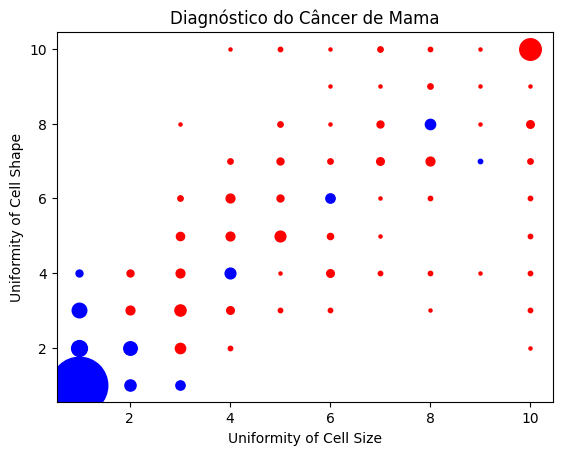

# Análise de Dados de Diagnóstico de Cancro da Mama

Este projeto utiliza um conjunto de dados clássico em bioinformática, contendo informações de diagnóstico de cancro da mama por paciente, retirado [desta](https://archive.ics.uci.edu/ml/datasets/Breast+Cancer+Wisconsin+(Diagnostic)) fonte e disponibilizado como um ficheiro CSV [aqui](../scripts/projeto3/dados/breast_cancer.csv).   
## Conjunto de Dados
O conjunto de dados utilizado neste projeto contém informações sobre várias características das células presentes em amostras de tecido mamário, bem como o diagnóstico final de benigno (B) ou maligno (M). As informações detalhadas sobre as colunas podem ser encontradas na descrição fornecida [aqui](https://archive.ics.uci.edu/ml/machine-learning-databases/breast-cancer-wisconsin/breast-cancer-wisconsin.names).
## Função Implementada
Foi implementada a função `desenhaDiagnostico` para gerar um gráfico de dispersão (scatter plot) que destaca a correlação entre alguns atributos e o diagnóstico final: 
  Esta função gera um gráfico de dispersão com os atributos "Uniformity of Cell Size" nos eixos X e "Uniformity of Cell Shape" nos eixos Y. Cada ponto no gráfico é colorido de acordo com o diagnóstico (atributo "Class"). Além disso, o tamanho de cada ponto é proporcional ao número de entradas com os mesmos valores de X e Y. 

## Resultado Esperado

Ao executar o código, será gerado um gráfico de dispersão que destaca a correlação entre os atributos "Uniformity of Cell Size" e "Uniformity of Cell Shape" em relação ao diagnóstico final de benigno ou maligno. Cada ponto no gráfico será colorido de acordo com o diagnóstico, e o tamanho do ponto será proporcional ao número de entradas com os mesmos valores de X e Y.
  

